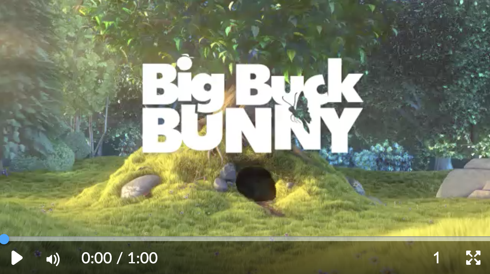

# media-player

[](https://www.npmjs.org/package/@brightspace-ui-labs/media-player)
[](https://app.dependabot.com/)
[](https://travis-ci.com/@brightspace-ui-labs/media-player)

> Note: this is a ["labs" component](https://github.com/BrightspaceUI/guide/wiki/Component-Tiers). While functional, these tasks are prerequisites to promotion to BrightspaceUI "official" status:
>
> - [ ] [Design organization buy-in](https://github.com/BrightspaceUI/guide/wiki/Before-you-build#working-with-design)
> - [ ] [design.d2l entry](http://design.d2l/)
> - [ ] [Architectural sign-off](https://github.com/BrightspaceUI/guide/wiki/Before-you-build#web-component-architecture)
> - [x] [Continuous integration](https://github.com/BrightspaceUI/guide/wiki/Testing#testing-continuously-with-travis-ci)
> - [ ] [Cross-browser testing](https://github.com/BrightspaceUI/guide/wiki/Testing#cross-browser-testing-with-sauce-labs)
> - [x] [Unit tests](https://github.com/BrightspaceUI/guide/wiki/Testing#testing-with-polymer-test) (if applicable)
> - [x] [Accessibility tests](https://github.com/BrightspaceUI/guide/wiki/Testing#automated-accessibility-testing-with-axe)
> - [x] [Visual diff tests](https://github.com/BrightspaceUI/visual-diff)
> - [x] [Localization](https://github.com/BrightspaceUI/guide/wiki/Localization) with Serge (if applicable)
> - [x] Demo page
> - [x] README documentation

A LitElement based media player component, designed for similarity across browsers.



## Installation

To install from NPM:

```shell
npm install @brightspace-ui-labs/media-player
```

## Usage

```html
<script type="module">
    import '@brightspace-ui-labs/media-player/media-player.js';
</script>
<d2l-labs-media-player src="<URL of media source>"></d2l-labs-media-player>
```

**Properties:**

| Property | Type | Description |
|--|--|--|
| src | string | URL of the media to play. |

## Developing, Testing and Contributing

After cloning the repo, run `npm install` to install dependencies.

### Running the demos

To start an [es-dev-server](https://open-wc.org/developing/es-dev-server.html) that hosts the demo page and tests:

```shell
npm start
```

### Linting

```shell
# eslint and lit-analyzer
npm run lint

# eslint only
npm run lint:eslint

# lit-analyzer only
npm run lint:lit
```

### Testing

```shell
# lint, unit test and visual-diff test
npm test

# lint only
npm run lint

# unit tests only
npm run test:headless

# debug or run a subset of local unit tests
# then navigate to `http://localhost:9876/debug.html`
npm run test:headless:watch
```

### Visual Diff Testing

This repo uses the [@brightspace-ui/visual-diff utility](https://github.com/BrightspaceUI/visual-diff/) to compare current snapshots against a set of golden snapshots stored in source control.

```shell
# run visual-diff tests
npm run test:diff

# subset of visual-diff tests:
npm run test:diff -- -g some-pattern

# update visual-diff goldens
npm run test:diff:golden
```

Golden snapshots in source control must be updated by Travis CI. To trigger an update, press the "Regenerate Goldens" button in the pull request `visual-difference` test run.

## Versioning, Releasing & Deploying

All version changes should obey [semantic versioning](https://semver.org/) rules.

Include either `[increment major]`, `[increment minor]` or `[increment patch]` in your merge commit message to automatically increment the `package.json` version and create a tag.
