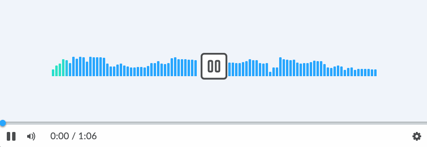
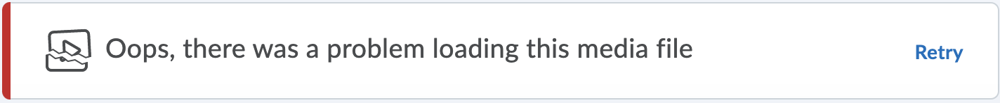

# media-player

[](https://www.npmjs.org/package/@brightspace-ui-labs/media-player)

> Note: this is a ["labs" component](https://github.com/BrightspaceUI/guide/wiki/Component-Tiers). While functional, these tasks are prerequisites to promotion to BrightspaceUI "official" status:
>
> - [ ] [Design organization buy-in](https://github.com/BrightspaceUI/guide/wiki/Before-you-build#working-with-design)
> - [ ] [design.d2l entry](http://design.d2l/)
> - [ ] [Architectural sign-off](https://github.com/BrightspaceUI/guide/wiki/Before-you-build#web-component-architecture)
> - [x] [Continuous integration](https://github.com/BrightspaceUI/guide/wiki/Testing#testing-continuously-with-travis-ci)
> - [x] [Cross-browser testing](https://github.com/BrightspaceUI/guide/wiki/Testing#cross-browser-testing-with-sauce-labs)
> - [x] [Unit tests](https://github.com/BrightspaceUI/guide/wiki/Testing#testing-with-polymer-test) (if applicable)
> - [x] [Accessibility tests](https://github.com/BrightspaceUI/guide/wiki/Testing#automated-accessibility-testing-with-axe)
> - [x] [Visual diff tests](https://github.com/BrightspaceUI/visual-diff)
> - [x] [Localization](https://github.com/BrightspaceUI/guide/wiki/Localization) with Serge (if applicable)
> - [x] Demo page
> - [x] README documentation

A LitElement based media player component, designed for similarity across browsers. Capable of playing video and audio content.

> Displaying video


> Displaying audio


> Loading media


> Media Error


## Installation

To install from NPM:

```shell
npm install @brightspace-ui-labs/media-player
```

## d2l-labs-media-player

```html
<script type="module">
    import '@brightspace-ui-labs/media-player/media-player.js';
</script>
<d2l-labs-media-player src="/video.webm"></d2l-labs-media-player>
```

**Properties:**

| Property | Type | Default | Description |
|--|--|--|--|
| allow-download| Boolean | false | If set, will allow the media to be downloaded.
| autoplay | Boolean | false | If set, will play the media as soon as it has been loaded. |
| loop | Boolean | false | If set, once the media has finished playing it will replay from the beginning. |
| poster | String | null | URL of the image to display in place of the media before it has loaded. |
| src | String, required |  | URL of the media to play. |

```
<!-- Render a media player with a source file and loop the media when it reaches the end -->

<d2l-labs-media-player loop src="./local-video.mp4"></d2l-labs-media-player>
```

**Attributes:**

| Attribute | Type | Get/Set | Description |
|--|--|--|--|
| currentTime | Number | Get & Set | Current time playback time of the media in seconds. |
| duration | Number | Get | Total duration of the media in seconds. |
| ended | Boolean | Get | Whether or not the video has ended. |
| paused | Boolean | Get | Whether or not the video is currently paused. |
| sourceType | ["audio", "video", "unknown"] | Get | The source type of the media.

```
// Programatically determine the current playback time of the media player

console.log(`Current playback time of the media player = ${this.document.querySelector('d2l-labs-media-player').currentTime} sec`);
```

**Methods:**

| Method | Type | Description |
|--|--|--|
| exitFullscreen() | void | Requests to exit fullscreen mode from the browser. Ignored if it is not playing video content, or if the video is not in fullscreen mode.
| play() | void | Begins playing the media. Ignored if the media is already playing.
| pause() | void | Pauses the media. Ignored if the media is already paused.
| requestFullscreen() | void | Requests fullscreen mode from the browser. Ignored if it is not playing video content, or the video is already in fullscreen mode.

```
// Programatically pause the media player

this.document.querySelector('d2l-labs-media-player').pause();
```

**Events:**

| Event | Description |
|--|--|
| ended | Dispatched when the media has reached the end of its duration. |
| error | Dispatched when the media failed to load. |
| loadeddata | Dispatched when the media at the current playback position has finished loading. Often the first frame. |
| loadedmetadata | Dispatched when the metadata for the media has finished loading. |
| play | Dispatched when the media begins playing. |
| pause | Dispatched when the media is paused. |
| timeupdate | Dispatched when the currentTime of the media player has been updated. |

```
// Listen for the loadeddata event

this.document.querySelector('d2l-labs-media-player').addEventListener('loadeddata', () => {
	console.log('loadeddata event has been dispatched');
});
```

## Captions and Subtitles Using `<track>`

The media player supports captions and subtitles, provided as `.srt` or `.vtt` files. If any valid tracks are present, a captions menu will be presented in the settings menu with an item for each track.

```html
<script type="module">
    import '@brightspace-ui-labs/media-player/media-player.js';
</script>
<d2l-labs-media-player src="/video.webm">
	<track src="/english-captions.srt" srclang="en" label="English" kind="captions">
	<track src="/french-captions.vtt" srclang="fr" label="French" kind="captions">
</d2l-labs-media-player>
```

**Properties**

| Property | Type | Default | Description |
|--|--|--|--|
| kind | ["captions", "subtitles"], required | The kind of track.
| label | String, required | The label for the track, displayed to the user for selection.
| src | String, required | The URL of the source file.
| srclang | String, required | The language's code.

## Accessibility

The following features are implemented to improve accessibility:

- all controls can be accessed using the mouse or keyboard
- captions can be provided to the media player
- important events, such as a media source failing to load, are displayed visually and announced by screen readers

## Developing, Testing and Contributing

After cloning the repo, run `npm install` to install dependencies.

### Running the demos

To start an [es-dev-server](https://open-wc.org/developing/es-dev-server.html) that hosts the demo page and tests:

```shell
npm start
```

### Linting

```shell
# eslint and lit-analyzer
npm run lint

# eslint only
npm run lint:eslint

# lit-analyzer only
npm run lint:lit
```

### Testing

```shell
# lint, unit test and visual-diff test
npm test

# lint only
npm run lint

# unit tests only
npm run test:headless

# debug or run a subset of local unit tests
# then navigate to `http://localhost:9876/debug.html`
npm run test:headless:watch
```

### Visual Diff Testing

This repo uses the [@brightspace-ui/visual-diff utility](https://github.com/BrightspaceUI/visual-diff/) to compare current snapshots against a set of golden snapshots stored in source control.

```shell
# run visual-diff tests
npm run test:diff

# subset of visual-diff tests:
npm run test:diff -- -g some-pattern

# update visual-diff goldens
npm run test:diff:golden
```

Golden snapshots in source control must be updated by Travis CI. To trigger an update, press the "Regenerate Goldens" button in the pull request `visual-difference` test run.

## Versioning & Releasing

> TL;DR: Commits prefixed with `fix:` and `feat:` will trigger patch and minor releases when merged to `master`. Read on for more details...

The [sematic-release GitHub Action](https://github.com/BrightspaceUI/actions/tree/master/semantic-release) is called from the `release.yml` GitHub Action workflow to handle version changes and releasing.

### Version Changes

All version changes should obey [semantic versioning](https://semver.org/) rules:
1. **MAJOR** version when you make incompatible API changes,
2. **MINOR** version when you add functionality in a backwards compatible manner, and
3. **PATCH** version when you make backwards compatible bug fixes.

The next version number will be determined from the commit messages since the previous release. Our semantic-release configuration uses the [Angular convention](https://github.com/conventional-changelog/conventional-changelog/tree/master/packages/conventional-changelog-angular) when analyzing commits:
* Commits which are prefixed with `fix:` or `perf:` will trigger a `patch` release. Example: `fix: validate input before using`
* Commits which are prefixed with `feat:` will trigger a `minor` release. Example: `feat: add toggle() method`
* To trigger a MAJOR release, include `BREAKING CHANGE:` with a space or two newlines in the footer of the commit message
* Other suggested prefixes which will **NOT** trigger a release: `build:`, `ci:`, `docs:`, `style:`, `refactor:` and `test:`. Example: `docs: adding README for new component`

To revert a change, add the `revert:` prefix to the original commit message. This will cause the reverted change to be omitted from the release notes. Example: `revert: fix: validate input before using`.

### Releases

When a release is triggered, it will:
* Update the version in `package.json`
* Tag the commit
* Create a GitHub release (including release notes)
* Deploy a new package to NPM

### Releasing from Maintenance Branches

Occasionally you'll want to backport a feature or bug fix to an older release. `semantic-release` refers to these as [maintenance branches](https://semantic-release.gitbook.io/semantic-release/usage/workflow-configuration#maintenance-branches).

Maintenance branch names should be of the form: `+([0-9])?(.{+([0-9]),x}).x`.

Regular expressions are complicated, but this essentially means branch names should look like:
* `1.15.x` for patch releases on top of the `1.15` release (after version `1.16` exists)
* `2.x` for feature releases on top of the `2` release (after version `3` exists)
